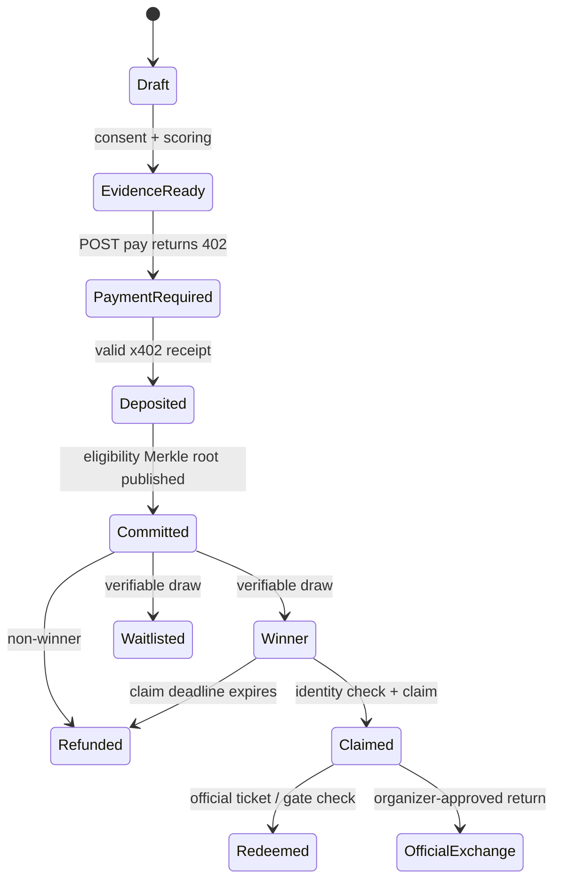
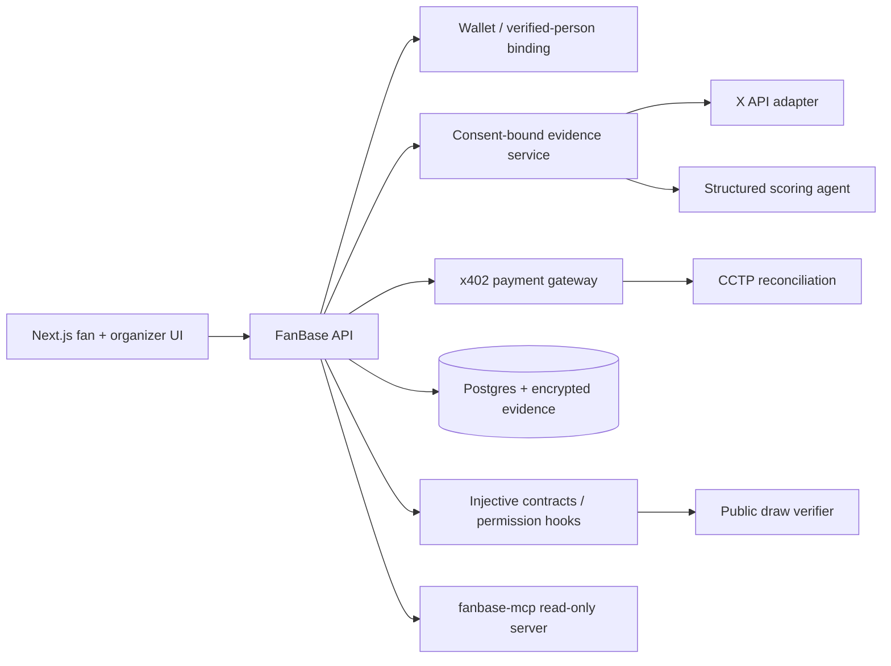

# FanBase — fair access for real fans

## Product decision

**Build FanBase as an organizer-operated, proof-backed ticket allocation protocol — not a resale marketplace.**

The original idea has an excellent core: replace chaotic first-come-first-served drops with a transparent way to give committed supporters a genuine chance. We should make three essential changes:

1. **No “highest score always wins” queue.** A perpetually re-sorted queue rewards people who can optimize social activity, creates an opaque popularity contest, and makes it easy to game. FanBase uses *eligibility bands plus a verifiable weighted draw*, so every legitimate applicant has a chance and proven engagement improves the odds only within a capped range.
2. **No tradable ticket NFT.** A transferable ticket becomes a scalper asset. FanBase issues a non-transferable Allocation Pass that the organizer converts to the official ticket. The pass is bound to a verified person and wallet; the only resale path is the organizer’s approved, price-capped exchange.
3. **Payments never increase rank.** USDC is a refundable application deposit / ticket payment, not a bid. The same amount is required for every applicant in a ticket tier. This makes access fair and prevents a pay-to-win queue.

This design preserves the good parts of crypto (programmable escrow, auditability, cross-chain USDC and credential controls) while keeping the organizer, legal terms, safety, and fan trust in control.

## One-sentence pitch

**FanBase turns a ticket rush into a provably fair fan allocation: opt-in fandom evidence earns a capped chance boost, x402 settles a refundable USDC application deposit, and Injective-backed non-transferable access passes stop scalping before the gate.**

## Problem and wedge

High-demand World Cup / concert sales fail in predictable ways:

- First-come-first-served queues reward bots, fast devices, and luck rather than genuine supporters.
- Providers cannot show why someone received a ticket or defend the draw when complaints arise.
- The secondary market creates fake listings, speculative buying, and extreme markups.
- Genuine fans are asked to surrender personal data without an understandable allocation process.

Start with a **demo “Argentina vs France — 1,000-seat FanBase allocation”**. It is concrete, emotionally legible, and lets the judges test a full lifecycle without claiming affiliation with FIFA or selling real World Cup tickets. The product is designed for any licensed organizer; any production FIFA integration must require FIFA authorization and follow its then-current ticket terms.

## Why this can win the Injective Global Cup

The hackathon explicitly asks for useful, functional World Cup products that meaningfully use x402, CCTP, MCP Server, and Agent Skills; cross-chain ticketing/payments and fan rewards are named directions. Judging emphasizes usefulness, execution, simplicity, code quality, World Cup data, new Injective tech, and future contribution. FanBase maps directly to every one of those points.

| Hackathon signal | FanBase proof in the demo |
| --- | --- |
| World Cup data | Match catalog / teams / players are pulled through a single data-provider adapter; the agent builds each match evidence query from that roster. |
| x402 | `POST /v1/applications/{id}/pay` responds with a real `402 Payment Required`; retry with `PAYMENT-SIGNATURE` locks the standardized USDC deposit and returns a signed receipt. |
| CCTP | USDC from a supported source chain moves 1:1 to the FanBase settlement wallet on Injective before allocation / refund. |
| MCP + Agent Skill | A `fanbase-mcp` server exposes read-only tools for a support/audit agent: explain score, fetch evidence hashes, verify draw proof, and display refund status. A `SKILL.md` teaches agents the safe workflow. |
| Injective-specific value | A permissioned MTS Allocation Pass enforces non-transferability at chain level. The issuer can revoke, burn, or reissue only via the organizer’s official exchange path. |
| Simple demo | One match, four screens, one transaction flow, one draw, one pass verification — no speculative marketplace. |

## Product model

### Roles

- **Organizer** — configures a match allocation, ticket inventory, ticket price, evidence rubric, score caps, dates, and official-resale policy.
- **Fan / applicant** — verifies a wallet and identity, consents to a bounded evidence import, places a refundable deposit, reviews their explanation, and claims if selected.
- **FanBase agent** — extracts eligible signals, runs deterministic checks plus a structured AI classifier, and emits signed score evidence.
- **Auditor / support agent** — verifies the public allocation commitment and explains a result without accessing raw social posts.
- **Venue / ticket issuer** — verifies a pass and binds it to the official ticketing / entry system.

### Fan journey

```mermaid
sequenceDiagram
  participant F as Fan
  participant W as Wallet
  participant A as FanBase API + Agent
  participant X as x402 facilitator
  participant I as Injective / escrow
  participant O as Organizer

  F->>A: Select match; connect identity + optional X account
  A->>A: Build bounded evidence set and explainable score
  A-->>F: Score band, factors, privacy preview, deposit amount
  F->>A: Pay application deposit
  A-->>F: 402 Payment Required
  F->>W: Sign USDC payment payload
  W->>A: Retry with PAYMENT-SIGNATURE
  A->>X: Verify and settle; issue signed receipt
  A->>I: Record escrow/application commitment
  O->>I: Publish inventory + draw seed commitment
  I-->>A: Finalize seeded weighted draw
  A-->>F: Winner / waitlist / refund result + proof
  F->>I: Claim non-transferable Allocation Pass
  I-->>O: Authorized redemption / entry verification
```

## Fairness algorithm: eligibility + capped weighted draw

Do **not** show a fake “live queue position.” The only position that matters is the final draw proof. Until the application window closes, new valid applicants can enter; then the batch is frozen and committed on chain.

### 1. Hard eligibility gates

All gates must pass before an applicant enters the draw:

- organizer identity / age / geography rules (only if required for the event);
- one verified person per match allocation (not merely one wallet);
- one wallet bound to that person; anti-sybil checks and manual appeal path;
- payment deposit locked before cutoff;
- opt-in terms, privacy notice, and anti-bot attestation;
- evidence only from the declared lookback window and only where permitted.

Failure does not label a person a bad fan; it returns the deposit and gives a clear reason and appeal option.

### 2. Explainable Fan Signal Score (0–100)

Signals are inputs to a capped probability boost, not an absolute ticket rank.

| Component | Max | Measurement | Anti-gaming rule |
| --- | ---: | --- | --- |
| Match relevance | 30 | Unique, substantive posts mentioning a participating team/player or official tournament topic in the lookback window. | Per-post cap; duplicates, reposts, keyword stuffing, and posts after application start get zero. |
| Long-term fandom | 20 | Evidence distributed across historical windows, optional supporter-club / prior-event attestations. | Time decay; a single viral post cannot dominate. |
| Community contribution | 15 | Original fan art, analysis, or constructive match discussion assessed against a public rubric. | AI returns structured labels + confidence; low confidence routes to neutral score or review. |
| Verified fan actions | 25 | Optional organizer attestations: merchandise, attendance, club membership, volunteer activity. | Issuer-signed attestations only; no purchase-size points. |
| Integrity / diversity | 10 | Account / evidence consistency and an organizer-defined allocation diversity objective. | Never infer protected traits; no follower count, wealth, or engagement popularity. |

**Score policy**

- Default 50 points when a fan declines social connection. Social evidence is optional, never a requirement to participate.
- Publish factor values, evidence IDs / hashes, model version, rubric version, and score expiry to the applicant.
- Store raw social text encrypted with a short retention period; anchor only a salted evidence-set hash and signed score commitment on chain.
- The AI may classify content into a fixed JSON schema, but formula aggregation is deterministic code. No LLM may directly return a rank.
- Create a human review / appeal endpoint; successful appeals regenerate and supersede the commitment.

### 3. Score to ticket probability

Convert score to a compact band and weight, preventing any user from purchasing certainty:

| Score band | Weight |
| --- | ---: |
| 0–39 | 1.00 |
| 40–59 | 1.15 |
| 60–74 | 1.30 |
| 75–89 | 1.45 |
| 90–100 | 1.60 |

Run a deterministic weighted sample without replacement after close:

1. FanBase posts the Merkle root of eligible applications, inventory, algorithm version, weights, and a **pre-draw seed commitment** `H(seed)`.
2. At close, it obtains a public randomness input (for MVP, a specified Injective block hash after close) and reveals `seed`.
3. For each application, derive `r = H(seed || publicRandomness || applicationId)`; use an Efraimidis–Spirakis weighted key `k = -ln(U(r)) / weight`.
4. Select the lowest `inventory` keys; next lowest form the waitlist.
5. Publish each applicant’s anonymized commitment, weight, and inclusion proof. A verifier recomputes the outcome.

Production note: use a verifiable randomness provider or validated multi-party commit-reveal rather than relying solely on a chain block hash. If the organizer controls when to close the draw, they could otherwise attempt timing manipulation.

### 4. Waiting list and expiry

- Winners have a clear claim deadline. Their deposit is applied to the ticket balance (or, in the demo, converted to an Allocation Pass).
- Expired / declined winners are burned or revoked and the next verifiable waitlist entry is promoted.
- Non-winners receive automatic USDC refund; failed or disputed payments are never added to the draw.

## Payment, ticket, and resale design

### Payment state machine



### x402

x402 is an HTTP payment protocol, not a marketplace or escrow standard. Use it exactly where it is strong: FanBase protects the deposit / application confirmation endpoint with a `402 Payment Required` response. The client signs the accepted USDC requirement and resubmits with `PAYMENT-SIGNATURE`; the service verifies/settles and returns a receipt. Persist the payment ID and idempotency key to prevent duplicate settlement.

For the hackathon, a real testnet x402 interaction and visible `402 → signed retry → receipt` is much stronger than a mock button. Confirm the currently supported Injective x402 scheme/facilitator during implementation; do not hard-code network support based on assumptions.

### CCTP

CCTP is the cross-chain settlement bridge, not a ranking mechanism. A fan may fund in USDC on a supported source chain; FanBase follows the burn → Circle attestation → mint flow to settle the 1:1 USDC value into the event settlement wallet / escrow on Injective. Maintain an off-chain reconciliation job keyed by CCTP message / attestation IDs and do not treat a deposit as final until mint confirmation.

### Allocation Pass (not an NFT ticket)

On Injective, issue one permissioned MTS fungible unit or an equivalent controlled credential per winning entitlement:

- transfer hook rejects every user-to-user transfer;
- only an issuer role may mint, burn, revoke, or move a pass to the official exchange escrow;
- metadata contains no name, social handle, or personal data—only an opaque application credential / hash;
- entry is a server-generated, short-lived QR challenge signed by the pass holder plus venue-side identity match;
- the pass is **not the FIFA / organizer ticket** until the licensed issuer maps it into the official ticket system.

For an approved resale, the holder returns the pass to the issuer. The issuer burns it, handles the price-capped refund/transfer via the organizer’s official channel, then mints a new bound pass. No peer-to-peer token transfer and no price discovery market exist.

## Architecture



### Components and boundaries

- **Web application:** match selection, consent, score explanation, payment, status, organizer dashboard, QR verification.
- **Application API:** source of truth for personally identifying data, applications, audit events, and transactional workflow.
- **Evidence adapter:** X integration behind an interface. MVP supports a user-supplied public handle and the official X API; production uses OAuth consent where access requires it. A mock fixture adapter keeps judging reproducible when credentials are unavailable.
- **Scoring agent:** uses team/player roster plus a public rubric to produce strict schema output (`eligiblePosts`, labels, confidence, exclusions). It cannot access wallet value, follower count, protected attributes, or the final lottery function.
- **Allocation engine:** deterministic scoring aggregation, close/freeze, Merkle tree, seed commitment, weighted draw, verifier artifact.
- **Smart contracts:** `EventConfig`, `AllocationCommitment`, `PassIssuer` / `PermissionsHook`. Keep sensitive social data and AI text off chain.
- **Settlement worker:** x402 receipt validation, CCTP burn/attestation/mint tracking, automatic refunds, retry-safe event processing.
- **MCP server:** read-only, least-privilege audit and support tools; it must never expose raw evidence or let an agent allocate a ticket.

## MVP scope — build this, demo this

### In scope

1. One seeded World Cup demo match with teams, player aliases, inventory, and ticket tiers.
2. Wallet connection and a demo verified-person binding (clearly labeled); one application per identity / match.
3. Consent screen, X handle field, curated fixture evidence plus an adapter interface for the live X API.
4. Structured agent scoring, deterministic aggregation, factor explanations, and a visible default score if social data is declined.
5. x402-protected payment endpoint with testnet USDC; receipt and idempotency shown in UI.
6. Close allocation, commit inputs, execute verifiable weighted draw, and display winner / waitlist / refund outcomes.
7. Deploy a minimal Injective permissioned pass / hook or demonstrate the call sequence on testnet, with user-to-user transfer rejection.
8. MCP tools: `get_application_explanation`, `verify_draw`, `get_refund_status`, `get_match_config`.
9. A README, 2–3 minute demo video, deployment URL, test accounts / fixtures, architecture diagram, and threat model.

### Explicitly out of scope for the hackathon

- Selling real FIFA tickets or representing FIFA affiliation.
- Biometric identity, passport storage, or real KYC implementation.
- A decentralized secondary exchange, auctions, royalties, or transferable ticket NFTs.
- Scraping X without permission, opaque social surveillance, or attempting to score private accounts.
- A production venue turnstile integration.

## Repository blueprint

```text
fanbase/
  apps/
    web/                 # Next.js fan + organizer experience
    api/                 # API / jobs / x402 endpoints
    mcp/                 # read-only FanBase MCP server
  packages/
    domain/              # types, state machine, deterministic scoring
    allocation/          # Merkle + weighted sample + verifier CLI
    evidence/            # X and fixture providers; redaction/retention
    contracts/           # Injective pass / permissions hook
    ui/                  # shared components
  data/
    matches/             # seeded roster / aliases data
    fixtures/            # consented synthetic public-post fixtures
  docs/
    architecture.md
    fairness-policy.md
    threat-model.md
    demo-script.md
  README.md
```

## Implementation plan

### Phase 0 — lock product rules (half day)

- Write `docs/fairness-policy.md`: scoring table, default score, bands, diversity rule, exclusion rule, appeal SLA, retention period, and refund policy.
- Choose a single demo match / inventory (for example 12 passes) and a fixed score rubric. Do not change parameters after applications begin.
- Decide the source of public randomness and document the seed commitment process.
- Define the disclaimer: “FanBase is a prototype; it is not affiliated with FIFA and does not sell official tickets.”

**Done when:** a judge can understand the complete policy in two minutes and reproduce a draw from supplied fixtures.

### Phase 1 — foundations and data (day 1)

- Scaffold the monorepo, TypeScript strict mode, linting, unit test runner, environment schema, and CI.
- Define domain objects: `Match`, `Application`, `EvidenceItem`, `ScoreReport`, `PaymentReceipt`, `AllocationCommitment`, `Pass`, `Refund`.
- Seed match roster data with aliases (team name, player names, hashtags) and synthetic public post fixtures that represent genuine, spam, duplicate, and irrelevant evidence.
- Implement the state machine and append-only audit log.

**Done when:** unit tests move a sample application through Draft → EvidenceReady → Deposited.

### Phase 2 — evidence and scoring (day 2)

- Build consent UX and evidence-provider interface.
- Implement `FixtureEvidenceProvider`, then `XEvidenceProvider` using official API query operators (not scraping); enforce date window, pagination, language, and data minimization.
- Build a structured AI prompt + schema validation. The model extracts relevance, originality, sentiment/context, and exclusion reason per post.
- Implement deterministic aggregation and the human-readable explanation screen.
- Add score tests: no connection defaults to 50; duplicate content does not increase score; a high follower count changes nothing; rubric changes create a new version.

**Done when:** every fixture has an expected score report and the UI explains the result without revealing a hidden model decision.

### Phase 3 — payments and settlement (day 3)

- Create `POST /applications/:id/pay` behind x402 middleware. First request returns `402`; valid retry returns a stored receipt.
- Enforce idempotency and state transition only after successful verification / settlement.
- Add a `SettlementProvider` interface with testnet x402 implementation and a CCTP reconciliation stub / integration path.
- Render payment amount, asset/network, transaction/receipt reference, and refund status.

**Done when:** a browser or scripted client performs the entire 402 flow twice and only one deposit is recorded.

### Phase 4 — draw and public verification (day 4)

- Build the eligible application Merkle tree and post / persist commitment input.
- Implement score-to-weight function and deterministic weighted sampling without replacement.
- Build a standalone verifier CLI / web panel that accepts the seed, public randomness, commitment, and application proofs.
- Generate waitlist and automatic refund candidates.
- Test invariants: no ineligible winner; no duplicate winner; same inputs always same result; any changed evidence / score breaks the commitment.

**Done when:** a judge can press “verify” and independently reproduce the winner list from committed inputs.

### Phase 5 — Injective pass and anti-scalping controls (day 5)

- Implement / deploy a minimal permissioned MTS pass and `PermissionsHook` that rejects holder-to-holder transfers.
- Add issuer-only mint, burn, revoke, and official-exchange transition methods; emit audit events.
- Create a claim screen and a holder verification / simulated gate QR challenge.
- Add contract tests proving transfer fails and issuer-mediated reissue succeeds.

**Done when:** the demo visibly rejects a normal transfer, then demonstrates a controlled reissue lifecycle.

### Phase 6 — MCP, polish, and submission (day 6–7)

- Publish `fanbase-mcp` read-only tools and `SKILL.md`; include authorization scopes and redacted responses.
- Build organizer dashboard: inventory, eligible count, score-band distribution, commitment, draw, waitlist, and refund actions.
- Finish mobile-first UX, empty/error states, consent, privacy controls, accessibility, and audit trail views.
- Write docs, record the demo, deploy testnet version, run tests, and prepare the Typeform + X submission assets.

**Done when:** a new developer can run the app, replay the seeded demo, verify the draw, and see each required Injective technology called out in the README.

## Testing and acceptance criteria

### Functional

- A fan can apply without linking X and is still eligible with the documented default score.
- An opted-in applicant sees exactly why each evidence item was included or excluded.
- Payment cannot be retried into duplicate deposits or duplicate applications.
- Allocation cannot execute before close or with a changed algorithm version / inventory.
- Winners and waitlist are reproducible from published inputs.
- A non-winner gets a refund state; a pass cannot be transferred by its holder.

### Security / abuse

- Rate-limit evidence and payment endpoints; bind application nonce to identity + match.
- Verify x402 payment requirements exactly; treat payment callbacks / receipts as idempotent; never trust the browser for paid status.
- Encrypt evidence at rest, redact logs, use secret manager for API credentials, and delete raw evidence on the stated schedule.
- Do not place social text, X handles, name, email, identity documents, or wallet-to-person mappings on chain.
- Separate organizer admin keys from pass issuer / treasury keys; use multisig in production.
- Add contract tests for unauthorized mint/burn/revoke and transfer-hook bypass attempts.
- Display “prototype testnet only” to prevent mistaken reliance on the demo as an official ticket sale.

### Fairness / governance

- Publish allocation rules before opening; version every rubric and weight table.
- Cap social score advantage; no points for payment size, follower count, or protected attributes.
- Offer a manual review and refund for wrongful exclusion.
- Report aggregate score-band outcomes to detect unexpected disparate impact; do not use protected attributes to make individual decisions.
- The organizer may set policy, but cannot silently edit closed applications or choose winners outside the committed draw.

## Demo script (2–3 minutes)

1. **Problem (15 sec):** “The fastest bot should not get the ticket; the richest reseller should not get a tradable asset.”
2. **Fan applies (35 sec):** Select the demo match, review consent, show two evidence items and the default-score alternative, then show the deterministic score explanation.
3. **x402 payment (25 sec):** Submit payment; show `402 Payment Required`, wallet signature, success receipt, and deposited state.
4. **Fair draw (35 sec):** Organizer closes applications, publishes commitment, reveals randomness, runs the verifier, and shows winner / waitlist / refund.
5. **Anti-scalping (25 sec):** Winner claims pass; direct transfer fails; organizer-controlled official exchange flow is the only exit.
6. **Agent and future (20 sec):** Ask the MCP support agent “why was I waitlisted?” It returns a redacted explanation and a draw proof—then close with organizer licensing / official integration path.

## Risks and answers

| Risk | Product answer |
| --- | --- |
| Social scoring is unfair or inaccessible | It is opt-in, capped, explainable, appealable, and has a meaningful no-social default. Use it as one chance multiplier, never a hard rank. |
| Bots / sybils create accounts | One person-per-match binding, deposits, rate limits, challenge signals, issuer attestations, and manual review; do not pretend a wallet alone proves a person. |
| AI makes mistakes | Constrain it to schema classification, aggregate deterministically, show evidence, use confidence thresholds, version prompts, allow appeal. |
| Privacy / X policy concern | Obtain consent, fetch minimum data through the official API, retain briefly, encrypt, store only derived hashes on chain, and support delete / disconnect. |
| “Blockchain ticket” enables scalping | Passes are permissioned and non-transferable; resale is issuer-only and price-capped. |
| Payment loss / chain mismatch | Use USDC only, confirm settlement, idempotency keys, receipt storage, reconciliation, and refunds. Keep a manual recovery procedure. |
| Claim of official FIFA support | Never claim it. Demo is a generic organizer allocation; production requires a licensed issuer integration and event-specific legal review. |

## Research notes

- The [Injective Global Cup brief](https://www.hackquest.io/hackathons/The-Injective-Global-Cup) runs July 3–19, 2026 and specifically names x402, CCTP, MCP Server, and Agent Skills; it requires a functional, documented submission with demo, GitHub, product link, and video. Its stated evaluation includes usefulness, execution, simplicity, code/docs, World Cup data, Injective-tech usage, and future contribution.
- The earlier [Fanbase Devfolio project](https://devfolio.co/projects/fanbase-or-coldplay-tickets-made-easy-a8be) already established the fairness, loyalty, royalty, and transparent-resale thesis. This plan narrows and improves it: verifiable allocation rather than opaque ranking, organizer-controlled resale rather than royalties, and a concrete Injective implementation.
- [x402’s protocol flow](https://docs.x402.org/core-concepts/client-server) is an HTTP 402 challenge followed by a signed retry and verification / settlement. It also supports signed offers and receipts, which is useful for auditable application payments. Its network support should be confirmed at implementation time rather than assumed.
- [Injective’s permissions module](https://docs.injective.network/developers-native/injective/permissions/index) and [permissioned MTS tokens](https://docs.injective.network/developers-evm/permissioned-multivm-token) support controlled assets and custom transfer restrictions, a direct fit for non-transferable access passes. [CCTP on Injective](https://docs.injective.network/developers-defi/usdc-cctp-tutorial) provides 1:1 USDC movement by burn, Circle attestation, and mint.
- The official [X Search Posts guide](https://docs.x.com/x-api/posts/search/integrate/overview) supports public-post search, query operators, pagination, and rate limits. Use it only after explicit user consent, with a short window and a fixture fallback.
- FIFA’s [World Cup 2026 transfer guidance](https://gpcustomersupportfwc2026.tickets.fifa.com/hc/en-gb/articles/30547592069149-3-Which-ticket-products-are-eligible-for-transfer-through-the-Ticket-Transfer-feature) shows ticket transfer is controlled by official rules and product eligibility. FanBase must work with—not bypass—the authorized issuer / exchange.

## Decisions needed before implementation

1. Is the hackathon demo strictly testnet / fictional tickets? **Recommended: yes.**
2. Which single testnet payment route and wallet stack will we use once Injective x402 facilitator compatibility is confirmed?
3. What is the demo’s verified-person substitute: simple email OTP + wallet binding, or mock organizer attestation? **Recommended: clearly labeled mock organizer attestation plus deterministic fixtures.**
4. Which AI provider / model do we have credentials and budget for? The scoring interface is provider-neutral.
